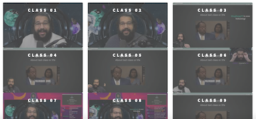
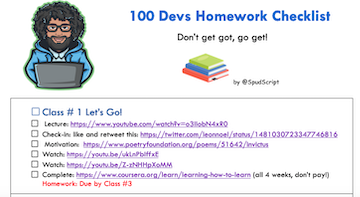
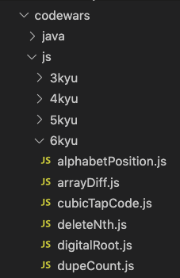
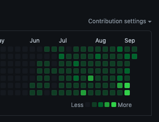

# 100Devs Catchup Crew FAQ

Welcome new 100Devs members! Getting started can be a little confusing, so I decided to write a guide to help you get situated. :)

## Fancy HTML Version

[The HTML version of the FAQ is available here](https://communitytaught.org/resources/faq)

## Table of Contents

1. [What is 100Devs?](#what-is-100devs)
2. [How does it work?](#how-does-it-work)
3. [How do I get started?](#how-do-i-get-started)
4. [Am I too late? Should I wait for the next cohort?](#am-i-too-late-should-i-wait-for-the-next-cohort)
5. [Will the content be taken down at some point? Do I need to worry about losing access?](will-the-content-be-taken-down-at-some-point-do-i-need-to-worry-about-losing-access)
6. [How do I join a house?](#how-do-i-join-a-house)
7. [How do I find an accountability buddy or study group?](#how-do-i-find-an-accountability-buddy-or-study-group)
8. [How should I make my Anki cards? Is there any premade deck I can use?](#how-should-i-make-my-anki-cards-is-there-any-premade-deck-i-can-use)
9. [Should I check in on Twitter for classes that happened months ago?](#should-i-check-in-on-twitter-for-classes-that-happened-months-ago)
10. [Where are the check-in links?](#where-are-the-check-in-links)
11. [Are the office hours videos still avalable?](#are-the-office-hours-videos-still-avalable)
12. [I'm doing all the homework, but should I submit it? Will anyone check it?](#im-doing-all-the-homework-but-should-i-submit-it-will-anyone-check-it)
13. [I need solutions for XX homework. Where can I find them?](#i-need-solutions-for-xx-homework-where-can-i-find-them)
14. [I already know XX. Should I start from Class 1? Can I get verified if I don't do all the classes?](#i-already-know-xx-should-i-start-from-class-1-can-i-get-verified-if-i-dont-do-all-the-classes)
15. [I missed some of the early check-ins or homework, do I need to go back and do them?](#i-missed-some-of-the-early-check-ins-or-homework-do-i-need-to-go-back-and-do-them)
16. [What exactly do I need to do for verification?](#what-exactly-do-i-need-to-do-for-verification)
17. [Where are the missing classes?](#where-are-the-missing-classes)
18. [I'm stuck on the readings! How do I get through them?](#im-stuck-on-the-readings-how-do-i-get-through-them)
19. [I'm stuck on floats! Can I just use Flexbox and Grid instead?](#im-stuck-on-floats-can-i-just-use-flexbox-and-grid-instead)
20. [How do I put my Codewars katas on Github?](#how-do-i-put-my-codewars-katas-on-github)
21. [I have old katas I didn't upload to Github. How do I backdate git commits?](#i-have-old-katas-i-didnt-upload-to-github-how-do-i-backdate-git-commits)
22. [How do I get Github green squares for private repositories?](#how-do-i-get-github-green-squares-for-private-repositories)

## What is 100Devs?

100Devs is a diverse and inclusive community of 1000s of participants in a training program run by [Leon Noel](https://leonnoel.com/). It is 100% free and requires absolutely no previous technical experience. 

As Leon says, 'this is not a tech bootcamp, this is a how to get a job bootcamp'. While the course does teach the necessary technical skills to get a job as a full stack developer, it's unique because it also covers networking, resumes, job applications, the interview process, and freelancing. Even if you're already technically proficient but you're struggling to find a job, you'll find value here.

## How does it work?

Live classes are streamed on [Twitch](https://www.twitch.tv/learnwithleon) Tuesdays and Thursdays and office hours (review classes) are streamed on Sundays. Recordings of all classes are available on [Youtube](https://www.youtube.com/playlist?list=PLBf-QcbaigsJysJ-KFZvLGJvvW-3sfk1S), however, office hours (which are not essential) are only on Twitch and are deleted after 60 days. Follow along materials are available on the [Discord](https://leonnoel.com/discord) and there are some community-made resources as well (see below). Homework is assigned at the end of each class, some of which should be submitted.

The material is self-paced. Although it's called the Catchup Crew, your goal is not to catch up to live classes. This is a significant time investment and you should give yourself the time and space to complete it according to your schedule and your constraints. 

The material is also self-directed. You get out what you put in, and that means you need to have a certain amount of focus and self-motivation to be successful. Having said that, we are community-taught and community-supported. Join the [Discord](https://leonnoel.com/discord), find [#100Devs on Twitter](https://twitter.com/search?q=%23100Devs). If you're struggling, if you need help, if there's something you can't figure out, ask! There is always someone around who's willing to lend a hand.

## How do I get started?

The classes are on [Youtube](https://www.youtube.com/playlist?list=PLBf-QcbaigsJysJ-KFZvLGJvvW-3sfk1S) and the follow along materials and homework assignments are available on the [Discord](https://leonnoel.com/discord). Tracking the classes and materials from Discord can be difficult, though, so I recommend you check out these community-made resources to make the process easier (there are a few others but these are the ones that are up to date):

- [Community Taught](https://communitytaught.org/): A full class and homework tracker (made by me!). Includes slides, follow-along materials, and check-in links as well as direct links to relevant homework materials. Shows homework assigned/due for each class. As of Oct 20, 2022: up to date until class 63 (latest).

- [100Devs Follow Along](https://100devsfollowalong.netlify.app/): Class videos and links to slides and follow-along materials. No check-in links. Shows homework assigned/due for each class. Updates when the videos are uploaded on Youtube. Includes slides and follow-along materials. As of Oct 20, 2022: up to date until class 52 (latest on Youtube).

- [100 Devs Homework Checklist](https://docs.google.com/document/d/177Ls9QS5ryjPBi82cjDnbtse5Of0RFl8/edit): A Google Docs checklist. Includes check-in links, but no slides or follow-along materials. As of Oct 20, 2022: up to date to class 60.

- [100 Devs Homework Tracker](https://labrocadabro.github.io/100devs-hw-tracker/): A web-based tool (made by me!) that focuses specifically on homework tracking, so no slides, check-in links, or follow-along maerials, but does have links to relevant homework materials. As of Oct 20, 2022: up to date to class 63 (latest).

- [100Devs Course List](https://winchy82dev.notion.site/12268a73ea854ae9bff22660d8a42274?v=403f5589c3734d09a3874648dfcb86fa): A notion site that includes classes and homework. Has slides and follow-along materials, but no check-in links. As of Oct 20, 2022: up to date to class 59.

- [Learn with Leon #100Devs Bootcamp 2022](https://docs.google.com/spreadsheets/d/1wyxTkcpVuz6hjc-LF734gEYxQN6DY95XEXQx7tEJm1E/edit#gid=0) - A Google Docs spreadsheet that covers classea and homework. Includes slides but no follow-along materials or check-in links. As of Oct 20, 2022: up to date to class 61.

- [Leon Stream Scripts](https://leonstreamscripts.herokuapp.com): searchable Youtube subtitles. Extremely useful when you remember something was mentioned but you forget which class. As of Sept 19, 2022: up to date to the latest Youtube class (47).

And join the [Discord](https://leonnoel.com/discord)! There are so many people there willing to help with any questions you have, big or small.

## Am I too late? Should I wait for the next cohort?

The first cohort was conducted in 2021; we are currently nearing the end of the second cohort. However, you're not too late! New people are joining every day, and Leon is working on systems to ensure that we can complete the course even after live classes have ended. 

Recently (beginning of Oct 2022) Leon has made comments that he's not sure he wants to do a third beginner bootcamp, as he has done two already and the content from both cohorts is available for anyone to access at any time. He has suggested that what he might do instead is a different course with more advanced material, covering the topics needed to advance from junior to senior dev.

Additionally, waiting means not learning. There's no reason to delay!  And if another cohort does start and you've been going through the catchup material, you'll have a head start.

In other words, start now and don't wait for a hypothetical future cohort!

## Will the content be taken down at some point? Do I need to worry about losing access?

Leon has said he'll keep the content up on Youtube permanently, and he's also looking into adding open source/open content licenses to everything.

The community-made resources are a little trickier, but most people have hosted their resources on free services that are unllikely to disappear (Github, Google Docs, etc). I am committed to keeping my progress tracker up as long as 100Devs exists. And while these are often very useful, they're never necessary.

## How do I join a house?

Originally there were houses for different levels of commitment to the program, but this cohort exploded in popularity and the houses were dropped early on. House Turing was re-introduced for Huntober but its importance is minimal and it is currently unavailable to new applicants.

## How do I find an accountability buddy or study group?

Check the Catchup Crew channel on Discord, every 2-4 weeks someone makes a new study group for members who have recently joined. If there's no recent group, go ahead and make one and invite others to join!

There is also the [Catchup Crew Google Sheet](https://docs.google.com/spreadsheets/d/1oZRvtvaP6AF0sxAn4dMZoDgR0AEntQvR0zJhNTixNhc/edit#gid=0) to keep track of where people are in the program, but it requires people to manually update as they progress, so it may not be accurate.

## How should I make my Anki cards? Is there any premade deck I can use?

**First a word of warning: Make sure you are using [Anki](https://apps.ankiweb.net/), [AnkiDroid](https://play.google.com/store/apps/details?id=com.ichi2.anki&hl=en&gl=US), or [AnkiMobile](https://apps.apple.com/us/app/ankimobile-flashcards/id373493387) (unfortunately this one is not free and Leon recommends using the web version of Anki instead), NOT Anki App. Anki App is a copycat that is not affiliated with the Anki project and it is not compatible with Ankiw.**

What you add to your deck is a personal decision based on what exactly you need to review, but in general, you will want to use Anki for important things you might forget or that feel complex and you need more review of the concepts. A lot of the early code will become familiar quickly because you'll be using it so much. And some things you encounter will be used so rarely you can just look them up when you need them. 

As for what to put on each card, try to keep questions and answers short and simple. Ideally each card should deal with exactly one fact/concept. Break up more complex topics into smaller pieces where possible. The type-in answer option is great for coding questions.

Once you get to Codewars, it's recommended that if you attempt a challenge and can't complete it after 20 min or so, you should check the solutions and add it to your Anki deck for review.

It is highly, highly recommended that you make your own Anki deck. Not only will it ensure that the questions and answers are customized to your needs, the process of making the cards is an excellent form of review in itself. If you use a premade deck, you're missing out on that learning opportunity.

Having said that, some people like to see what others have done just to get ideas for their own deck. A few resources are available:

[Anki Deck SE](https://github.com/mac-kenzie-lee/ankiDeckSE): this is not a deck specific to 100Devs, rather a template for more attractive cards that was made by a 100Devs member.

[!00Devs Anki Deck](https://github.com/abhisheknage/100Devs-Anki-Deck): this is a deck a 100Devs member shared. Again, I caution you to use it only for reference for how you might make your own cards.

[Banki Answers](https://github.com/curtisbarnard/BANKI): this one is not specifically for Anki, it's actually a template for filling out your Banki answers, with a completed version you can use for inspiration if necessary.

## Should I check in on Twitter for classes that happened months ago?

Yes. Check in for each class as you watch it. It's one of the requirements that will be checked when you're looking for work and you'd like a verification or reference from Leon.

## Where are the check-in links?

Currently the easiest way to find the check-in links is [the class listing of my progress tracker](https://communitytaught.org/class/all) but you can also find them in [this homework checklist](https://docs.google.com/document/d/177Ls9QS5ryjPBi82cjDnbtse5Of0RFl8/edit) or in the class announcements on Discord.

## Are the office hours videos still avalable?

The office hours videos are deleted from Twitch after 60 days, so most of them are no longer available. A 100Devs member in the catchup crew did make a partial (unlisted) Youtube playlist of office hours they downloaded from Twitch, but it doesn't start from the beginning of the cohort. You can find the link in the Catchup Resources thread in the Catchup Crew channel on Discord.

## I'm doing all the homework, but should I submit it? Will anyone check it?

Yes, you should submit it. No one is going to look at it and give you feedback, but as with checking in, it's one of the requirements for verification down the line. Do keep in mind that while your homework won't be checked when you submit it, there's a good chance Leon will look at it if you ask for verification. 

## I need solutions for XX homework. Where can I find them?

Most homework does not have provided solutions. If you build something and it looks/works the way you want it to, you did it right. If you can't figure out how to get something to work, ask for help!  

## I already know XX. Should I start from Class 1? Can I get verified if I don't do all the classes?

Definitely watch class 1 and do the homework, even if you intend to skip ahead. *Learning How to Learn* is extremely important.

I personally think it's worth starting from the beginning, even if you have some experience already. If you decide to start from the beginning but some material is familiar, you can watch classes on 1.5x or 2x, or skip sections you don't need. But it's not necessary to do so, the choice is yours. You can still get verification if you don't do the early homework; Leon annouced a clean slate in class 32, so anything you missed before that will be forgiven.

If you already know some topics well, you can skip the earliest classes. A popular entry point in that case is the [Javascript Super Review](https://www.youtube.com/watch?v=AkXLGS57MS4) (after class 18). 

If you are only looking for job hunting/freelancing advice, you can skip most of the classes, but you won't be able to get verification. Classes relevant to job hunting:

- [9: Networking Nght](https://youtu.be/OaglXfjsBaE)
- [15: How to Start Freelancing](https://youtu.be/OaglXfjsBaE)
- [25: Fix Your Resume](https://youtu.be/ZlB4BockYNQ)
- [33: Secrets to Landing Your First Tech Job](https://youtu.be/lIE1LFz4LJM)
- [34: Crush Your Technical Interviews](https://youtu.be/lIE1LFz4LJM)

These are the dedicated classes, but not the only ones that cover job-related topics. For other mentions, you can check the [searchable subtitles](https://leonstreamscripts.herokuapp.com).

## I missed some of the early check-ins or homework, do I need to go back and do them?

Leon announced a fresh start in class 32, so anything you missed before then, you don't have to go back and do. However keep in mind that: 

1. the course is completely free and takes a significant amount of effort on Leon's part
2. he asks you to check-in to help increase the reach of the course
3. the homework is your skills training, so even if you don't submit it you should still do it

## What exactly do I need to do for verification?

Vertification is still being hashed out and is currently only available at certain times (this is expected to change in the future). The next wave of verifications is expected to have a due date of Nov 1, 2022 but future waves are planned. Based on the Huntober submission form that was recently released, Leon will ask for the following:

- Bio blurb
- Github profile (make sure you've got your green squares)
- Codewars profile (make sure you've got plenty of completed katas)
- Screenshot of Anki deck (make sure you've been creating and reviewing cards)
- Angellist profile
- Portfolio
- Twitter account (make sure you've done all the class check-ins)
- Cover letter and cover email
- Resume
- Linkedin profile
- Hitlist/Networking Sheet (These can be one document or separate. Leon asks that you do networking weekly, so your networking sheet should have an appropriate number of connections and coffee chats)
- Binary Upload Boom group project 
- Information on a paid client (amount earned and website) OR organization you volunteered for OR approved pull request on open source project (must be a real contribution, not a 'first contribution' like fixing a typo)
- repo for completed 100 hours project (for the first wave this was just the MVP but Leon has said that going forward you will need to have the project complete)
- link to hosted 100h project if available (this may become mandatory once Leon has covered an alternative to Heroku)
- and it's not mentioned on the Huntober form but make sure you've submitted all the homework from class 32 onward

## Where are the missing classes?

Some classes aren't on Youtube. This is because they weren't regular classes. If you see that a class is missing, you can just move on to the next one; you haven't missed anything.

- Class 17: Networking Night
- Class 18: Project Night
- Classes 42 & 43: Welcome Back sessions after a long break
- Class 49: Catchup for Huntober Prep Work
- Class 53+: Not yet on Youtube

## I'm stuck on the readings! How do I get through them?

Some of the readings can be dense and everything you absolutely need to know is covered in class, but Leon assigns everything for a reason. The reading helps you get some familiarity with the concepts before Leon teaches them. And probably more importantly, on the job you will be required to read documentation, so you do need to get used to parsing technical language. 

However, that doesn't mean you need to understand every single point that's covered. Read to get a basic understanding and move on. And if you're getting completely derailed by the reading and you've been stuck on it for weeks, move on and make a note to revisit it later when you're more familiar with the concepts.

## I'm stuck on floats! Can I just use Flexbox and Grid instead?

Similar to the readings, Leon assigns everything for a reason. There is legacy code out there still using floats, because Flexbox and Grid weren't always well supported. You really should have at least a basic understanding of how they work.

And similar to the readings, don't spend too much time on floats. You probably won't actually use them all that much, and if you're stuck to the point you can't move on, it's better to take another look at them after you've learned more.

## How do I put my Codewars katas on Github?

Create a private repository just for Codewars. The most common method is a to create a new file for each kata you complete, and paste your solution in it when you complete the kata.

For example, my directory structure looks like this:

Rufio (a member of the Stream Team) also has a video on her [codewars workflow](https://www.youtube.com/watch?v=HazQz4qosR4).

## I have old katas I didn't upload to Github. How do I backdate git commits?

Rufio has two videos you can check out, one on her [entire codwars workflow](https://www.youtube.com/watch?v=HazQz4qosR4) and one on [how to backdate commits](https://www.youtube.com/watch?v=uFRY6Gxw9EA).

## How do I get Github green squares for private repositories?

Go to your profile and find your contribution graph. In the top right, there's a dropdown that says 'Contribution settings'. From there make sure 'Private Contributions' is checked.

